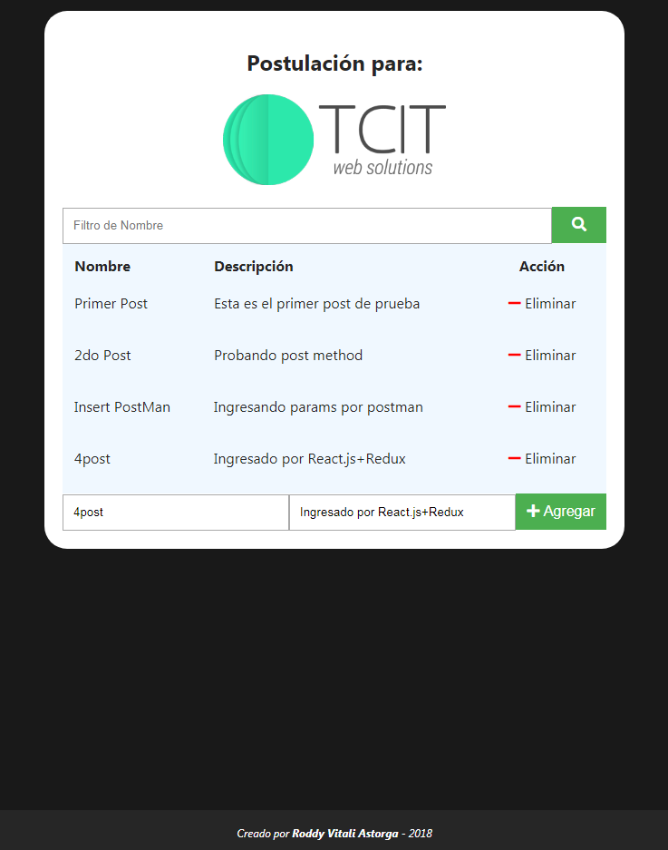

# posts-frontend

> Solución a Postulación de Desarrollo FrontEnd para TCI - Creación de un Sistema de posts, en el que puedes ingresar y eliminar al servidor y filtrar localmente.

Ejemplo representativo de la solución.



## Install
```sh
npm install
```

## Start
```sh
npm start
```

## Languages
>React.js + Redux

